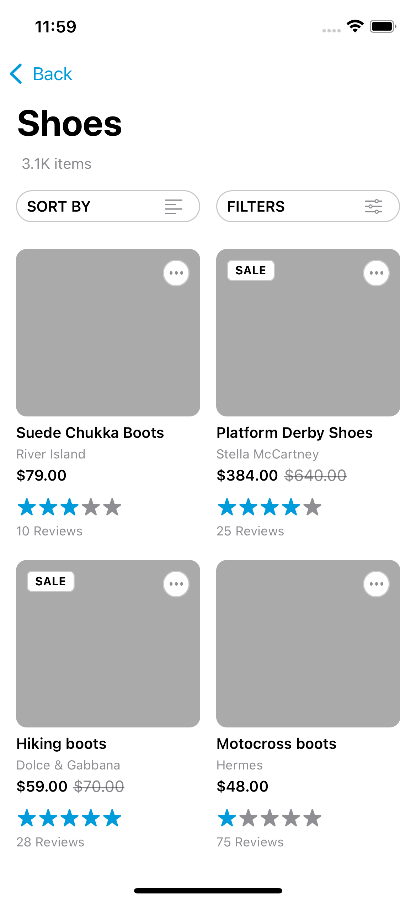
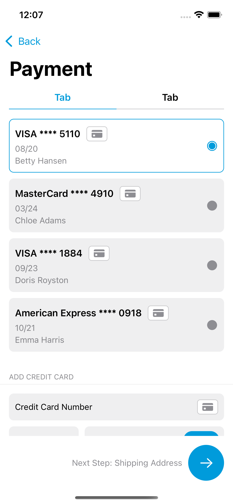

## OVERVIEW

App Design Kit is a collection of beautifully designed, ready-to-use, iOS app template screens. This well-structured, Swift coded, UI Kit bundle helps you to create your own application much faster than starting from scratch, using a simple design file.

The pre-programmed views can be used instantly by copying them to your existing Xcode project, or you can use the delivered project as a starter kit for your next mobile app. Now you can focus on your business logic instead of coding the user interface elements one by one.

## 📸 ScreenShots
| Page 1  | Page 2 | Page 3 | Page 4 |
| ------------- | ------------- | ------------- | ------------- |
|  |  |  |  |

| Page 5  | Page 6 | Page 7 | Page 8 |
| ------------- | ------------- | ------------- | ------------- |
|  |  |  |  |

| Page 9  | Page 10 | Page 11 | Page 12 |
| ------------- | ------------- | ------------- | ------------- |
|  |  |  |  |

| Page 13  | Page 14 | Page 15 | Page 16 |
| ------------- | ------------- | ------------- | ------------- |
|  |  |  |  |

| Page 17  | Page 18 | Page 19 | Page 20 |
| ------------- | ------------- | ------------- | ------------- |
|  |  |  |  |

| Page 21  | Page 22 | Page 23 | Page 24 |
| ------------- | ------------- | ------------- | ------------- |
|  |  |  |  |

| Page 25  | Page 26 | Page 27 | Page 28 |
| ------------- | ------------- | ------------- | ------------- |
|  |  |  |  |

| Page 29  | Page 30 | Page 31 | Page 32 |
| ------------- | ------------- | ------------- | ------------- |
|  | |  |  |

| Page 33  | Page 34 | Page 35 | Page 36 |
| ------------- | ------------- | ------------- | ------------- |
|  |  |  |  |

| Page 37  | Page 38 | Page 39 | Page 40 |
| ------------- | ------------- | ------------- | ------------- |
|  |  |  |  |

| Page 41  | Page 42 | Page 43 | Page 44 |
| ------------- | ------------- | ------------- | ------------- |
|   |  |  |  |

| Page 45  | Page 46 | Page 47 | Page 48 |
| ------------- | ------------- | ------------- | ------------- |
|  |  |  |  |

| Page 49  | Page 50 | Page 51 | Page 52 |
| ------------- | ------------- | ------------- | ------------- |
|   |    |  |  |

| Page 53  | Page 54 | Page 55 | Page 56 |
| ------------- | ------------- | ------------- | ------------- |
|   |    |  |  |

| Page 57  | Page 58 | Page 59 | Page 60 |
| ------------- | ------------- | ------------- | ------------- |
|   |    |  |  |

| Page 61  | Page 62 | Page 63 | Page 64 |
| ------------- | ------------- | ------------- | ------------- |
|   |    |  |  |

| Page 65  | Page 66 | Page 67 | Page 68 |
| ------------- | ------------- | ------------- | ------------- |
|   |    |  |  |

| Page 69  | Page 70 | Page 71 | Page 72 |
| ------------- | ------------- | ------------- | ------------- |
|   |    |  |  |

| Page 73  | Page 74 | Page 75 | Page 76 |
| ------------- | ------------- | ------------- | ------------- |
|   |    |  |  |

| Page 77  | Page 78 | Page 79 | Page 80 |
| ------------- | ------------- | ------------- | ------------- |
|   |    |  |  |
| Page 81  | Page 82 | Page 83 | Page 84 |
| ------------- | ------------- | ------------- | ------------- |
|   |    |  |  |

| Page 85  | Page 86 | Page 87 | Page 88 |
| ------------- | ------------- | ------------- | ------------- |
|   |    |  |  |

| Page 89  | Page 90 | 
| ------------- | ------------- | ------------- | ------------- |
|   |    |

| Page 91  | Page 92 | Page 93 | Page 94 |
| ------------- | ------------- | ------------- | ------------- |
|   |    |  |  |

| Page 95  | Page 96 | Page 97 | Page 98 |
| ------------- | ------------- | ------------- | ------------- |
|   |    |  |  |

| Page 99  | Page 100 | Page 101 | Page 102 |
| ------------- | ------------- | ------------- | ------------- |
|   |    |  |  |

## LICENSE

MIT License

Copyright (c) 2021 Related Code

Permission is hereby granted, free of charge, to any person obtaining a copy
of this software and associated documentation files (the "Software"), to deal
in the Software without restriction, including without limitation the rights
to use, copy, modify, merge, publish, distribute, sublicense, and/or sell
copies of the Software, and to permit persons to whom the Software is
furnished to do so, subject to the following conditions:

The above copyright notice and this permission notice shall be included in all
copies or substantial portions of the Software.

THE SOFTWARE IS PROVIDED "AS IS", WITHOUT WARRANTY OF ANY KIND, EXPRESS OR
IMPLIED, INCLUDING BUT NOT LIMITED TO THE WARRANTIES OF MERCHANTABILITY,
FITNESS FOR A PARTICULAR PURPOSE AND NONINFRINGEMENT. IN NO EVENT SHALL THE
AUTHORS OR COPYRIGHT HOLDERS BE LIABLE FOR ANY CLAIM, DAMAGES OR OTHER
LIABILITY, WHETHER IN AN ACTION OF CONTRACT, TORT OR OTHERWISE, ARISING FROM,
OUT OF OR IN CONNECTION WITH THE SOFTWARE OR THE USE OR OTHER DEALINGS IN THE
SOFTWARE.
